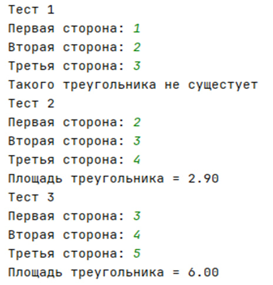
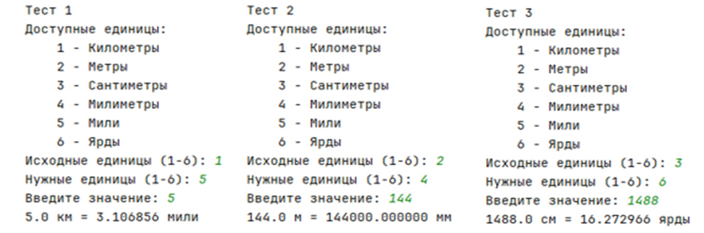
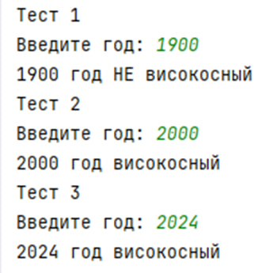

# Исполнитель
Чаулкин Добрыня \
Группа Фт-240008
# Лабораторная работа №2 – GitHub
## Задание 1.1 - Калькулятор площади треугольника
Напишите программу, которая вычисляет площадь треугольника по трём его сторонам (по формуле Герона) с точность до сотых.
# Среда разработки
Язык программирования: Python. \
Среда разработки: PyCharm Community Edition 2024.3.1
# Инструкция по работе
По запросу программы необходимо ввести три числа - длины сторон треугольника. Все стороны должны быть положительными числами.

После ввода программа проверит, может ли существовать треугольник с такими сторонами. Если треугольник существует, будет вычислена и показана его площадь. Если треугольник не может существовать, программа сообщит об ошибке.

Площадь треугольника вычисляется по формуле Герона и отображается с точностью до двух знаков после запятой.
# Результаты тестирования

## Задание 1.2 - Конвертер единиц измерения расстояния
Создайте программу-конвертер, которая переводит расстояние из одних единиц измерения в другие. Программа должна поддерживать следующие единицы: Километры (км), Метры (м), Сантиметры (см), Миллиметры (мм), Мили (mi), Ярды (yd).

# Инструкция по работе
По запросу программы необходимо выбрать исходные единицы измерения из списка (цифрой от 1 до 6), затем выбрать нужные единицы измерения (также цифрой от 1 до 6), после чего ввести числовое значение для конвертации.

Программа поддерживает конвертацию между километрами, метрами, сантиметрами, миллиметрами, милями и ярдами. Результат выводится с точностью до шести знаков после запятой.
# Результаты тестирования

## Задание 1.3 - Определение високосного года
Напишите программу, которая определяет, является ли введенный год високосным.

# Инструкция по работе
По запросу программы необходимо ввести год (целое число). Программа определяет, является ли введенный год високосным или нет, и выводит соответствующее сообщение.

Год считается високосным, если он делится на 4, но не делится на 100, либо если он делится на 400.

# Результаты тестирования

